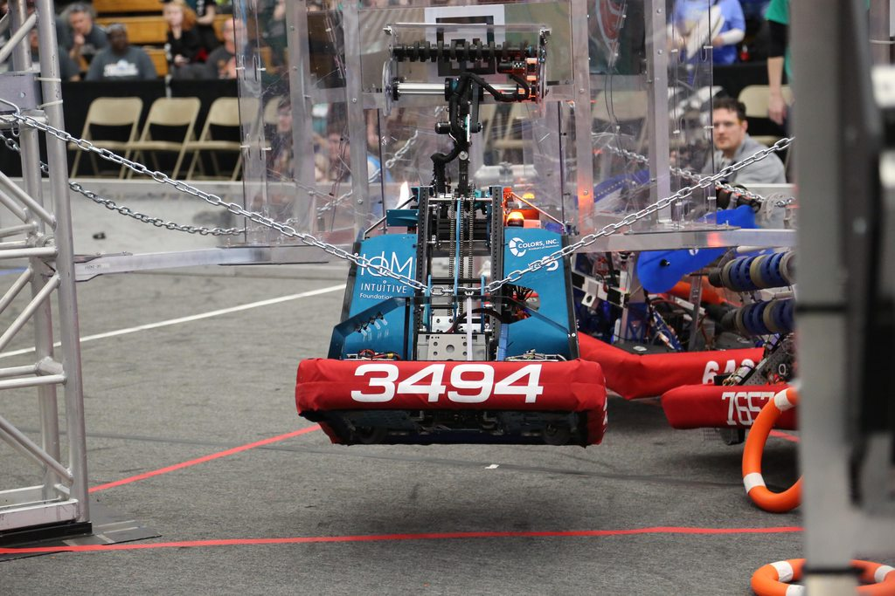
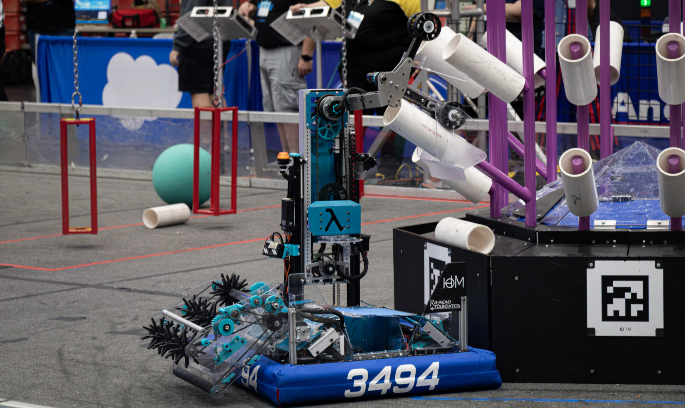

# FRC Team 3494 - The Quadrangles

  
   
  <b>Figure 1:</b> Aegeon - Our 2023 robot built for the CHARGED UP season
    
  
  
   
  <b>Figure 2:</b> Cadenza - Our 2024 robot built for the CRESCENDO season <a href="https://www.youtube.com/watch?v=H0aQ-AUTamk">[video]</a>
    
  
  
   
  <b>Figure 3:</b> Lambda - Our 2025 robot built for the REEFSCAPE season <a href="https://www.youtube.com/shorts/_BtnhCmMFJM">[video]</a>
    

Hi! We're a [FIRST Robotics Competition](https://www.firstinspires.org/robotics/frc) team located out of Bloomington Indiana.

Check us out on

[Youtube](https://www.youtube.com/@frc3494)

[Instagram](https://www.instagram.com/frc3494)

[Facebook](https://www.facebook.com/frc3494)

[The Blue Alliance](https://www.thebluealliance.com/team/3494)

Any code we have available publicly is free to use adherent to it's licensing.
